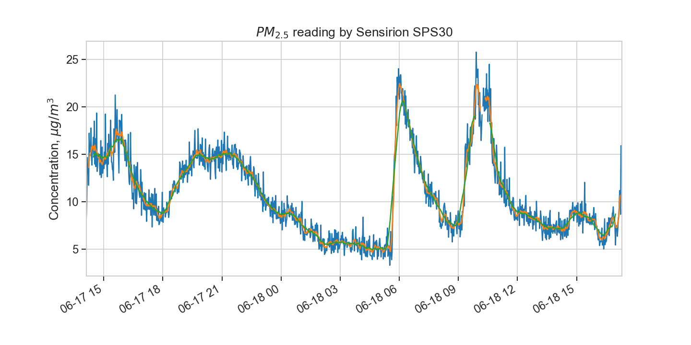
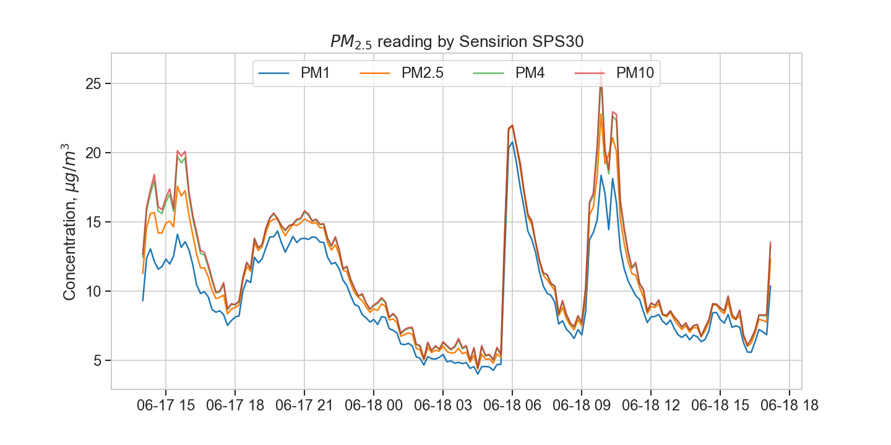
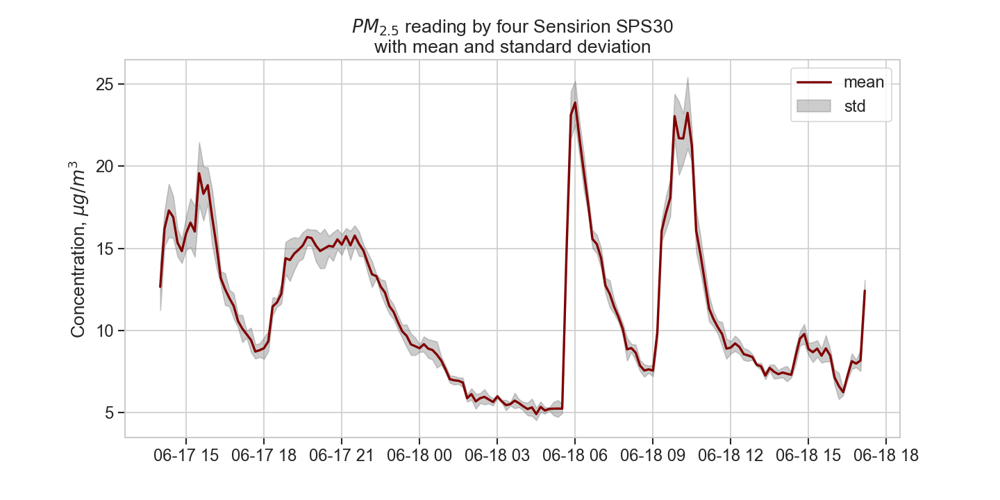

# Sensirion_SPS30
Python script to read multiple fine particles (PM1 to PM10) from Sensirion SPS30. The script can work with multiple devices connected to USB hub

# Set up
- Communication via UART with a SLAB CP2102 adapter
- For the pin, refer the SPS30 datasheet [stored here](#) or on [SparkFun](https://cdn.sparkfun.com/assets/2/d/2/a/6/Sensirion_SPS30_Particulate_Matter_Sensor_v0.9_D1__1_.pdf)
- Connect pin TX (on USB adapter) to RX pin (on SPS30)

# Run
- if you have all SPS30 connected to USB hub, then you can run all devices by 
```
    usbs = get_usb()
    print(usbs)
    process = list()
    for port in usbs:
        p = SPS30(port=port, push_mqtt=True)
        process.append(p)
    print('Starting')
    while True:
        for p in process:
            p.run_query()
```
- if you want to specify then manually goes through each port and make an instance for each device like this:
```
  s1 = SPS30(port='/dev/ttyUSB0')
  s2 = SPS30(port='/dev/ttyUSB3')
  while True:
      for p in [s1,s2]:
          p.run_query()

```

- data is logged into CSV file by default, to only read the CSV on terminal then set `save_data=False` like this:
```
  s1 = SPS30(port='/dev/ttyUSB0', save_data=False)
```
- in addition, if you want to push data to MQTT server, than config the details:
```
# MQTT host, users
mqtt = '192.168.1.100'  # change this
topic = 'sensor/sps30' # and this
auth = {'username': 'mqtt_user', 'password': 'mqtt_password'} # and these two
```
- and specify the this option:
```
p = SPS30(port=port, push_mqtt=False)
```

# Data analysis
- analyze data by each sensor using different moving average (to smooth out the data)
<p>
    
</p>
- or plot PM1 to PM10
<p>
    
</p>
- or to compare several sensors at one (in which this script is very useful)
<p>
    
</p>
- or to simpify by only the mean and standard deviation from multiple sensors
<p>
    
</p>

# Credit
The core of Python Inteface with SPS30 was forked from [feyzikesim](https://github.com/feyzikesim/sps30)
